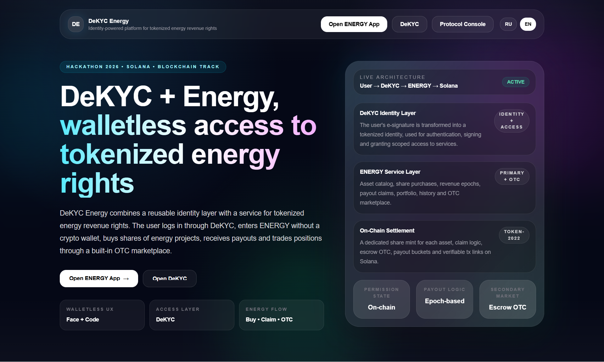
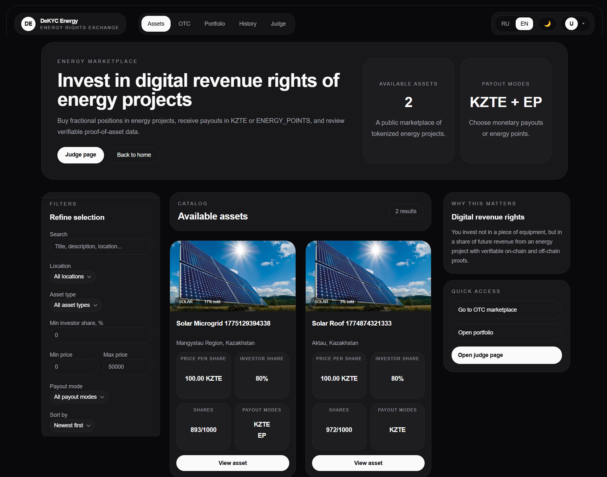
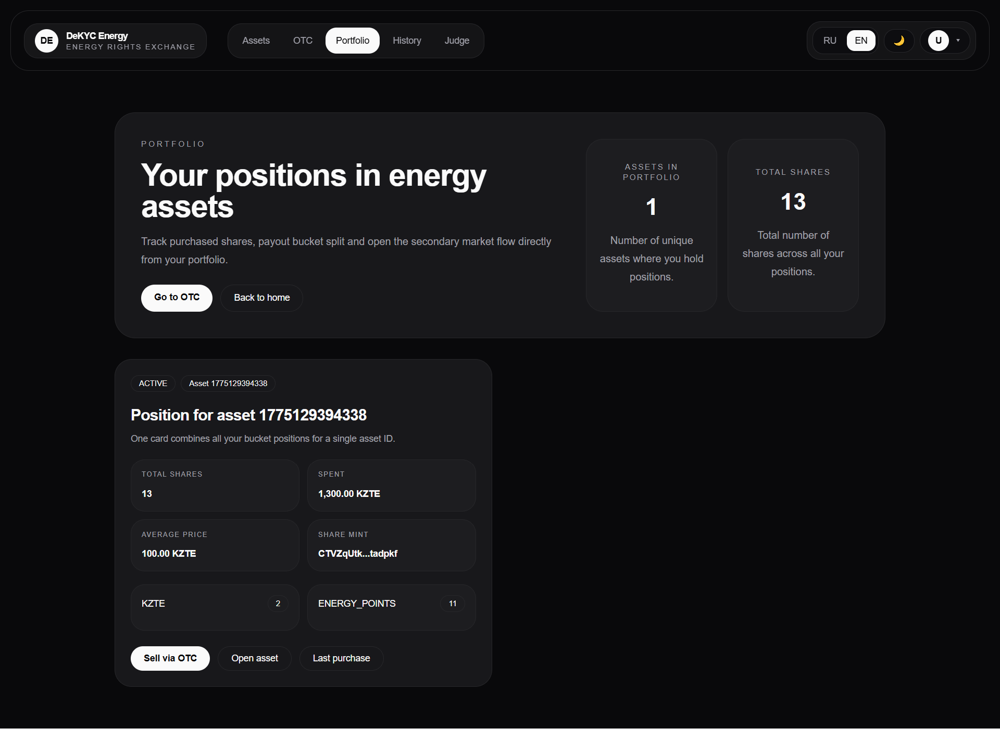
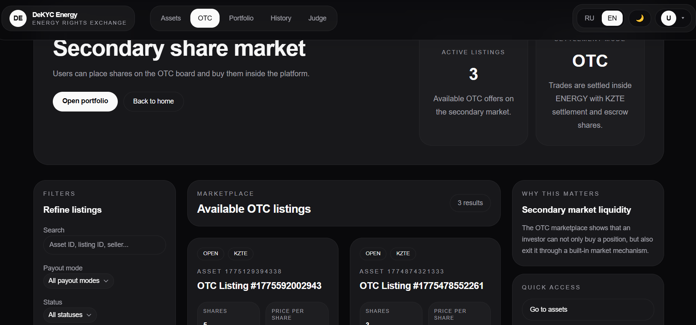
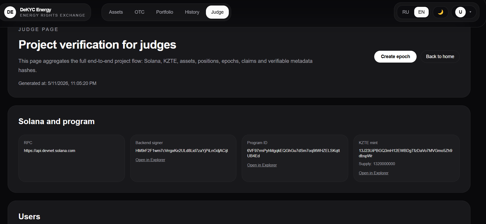

# DeKYC Energy ⚡  
### walletless platform for tokenizing energy revenue rights on Solana

[](https://github.com/denisthe12/dekyc-protocol/actions/workflows/ci-apps.yml)
[](https://github.com/denisthe12/dekyc-protocol/actions/workflows/ci-solana.yml)
[](https://solana.com)
[](#)
[](#)
[](#)
[](#)
[](#)

> **DeKYC Energy** is a product where a user logs in through **DeKYC** (a tokenized EDS key), gets access **without a crypto wallet**, and invests in **tokenized revenue rights from energy projects**.

[🚀 Pitch](https://youtu.be/hq4fOojhr2c) ·
[🎥 Video Demo](https://vimeo.com/1191260874?share=copy&fl=sv&fe=ci) ·
[🖥 Live App](https://dekyc-protocol-platform.vercel.app) ·
[🖼 Screenshots](#screenshots) ·
[📑 Presentation](https://docs.google.com/presentation/d/1VT2mq9yswmiEx-5EBXagIBV6YBl0yEmK/edit?usp=sharing&ouid=113841808140956424271&rtpof=true&sd=true) ·
[📚 Docs](docs/) ·
[🛡 DeKYC](docs/DeKYC.md) ·
[⚡ ENERGY](docs/ENERGY.md)

---

Test user - l0gin denissnims@gmail.com and p@ssw0rd Den12345

<p align="center">
  
</p>

---

## What is this project?

**DeKYC Energy** combines two layers:

- **DeKYC** — an identity and permission layer that uses an **EDS / digital signature** as the foundation for trusted identity and controlled access.
- **ENERGY** — an investment service where a user buys digital shares **in revenue rights**, receives payouts, and can sell the position via OTC.

### How is this project different from a regular tokenization demo?

Because it includes not only tokenization, but also:

- **login through DeKYC**
- **walletless UX**
- **private/public access**
- **proof bundle**
- **epoch-based payouts**
- **OTC secondary market**
- **judge-friendly on-chain verification**

---

## What problem does it solve?

### Problem 1 — investing in energy is complicated
For an ordinary person, it sounds like a bureaucratic and unclear process.

### Problem 2 — identity and access break the UX
Regular services force the user to:

- go through KYC again and again,
- share personal data with many platforms,
- understand wallets and web3 friction.

### Solution
**DeKYC Energy** makes the investment scenario clear:

**DeKYC login → custodial address → buy → epoch → claim → OTC**

---

## Why is DeKYC the main feature here? 🛡

Most tokenization projects stop at the following flow:

- connect a wallet,
- buy a token,
- view a tx.

**DeKYC Energy** goes further:

- the user logs in through **DeKYC**
- identity is based on **EDS**
- access to data is managed through a permission model
- the service receives only the required scope
- the user does not have to use a crypto wallet

> **In short:** DeKYC turns the EDS identity context into a reusable identity layer for services.

---

## Why ENERGY? ⚡

We chose the energy use case because:

- for citizens, energy is currently too complicated to invest in;
- small operators and local energy projects need a clear way to raise capital;
- B2B energy consumers may be interested in payouts not only in money, but also in **ENERGY_POINTS**.

---

## Why Solana? 🌐

- **Speed** — suitable for asset creation, buy, claim, and OTC flow.
- **Low transaction costs** — important for frequent state transitions.
- **Composability** — Anchor, PDA, and Token-2022 naturally fit the project architecture.
- **Token-2022 fit** — separate mints for **KZTE**, **share tokens**, and **ENERGY_POINTS**.

---

## What already works? ✅

- login through **DeKYC**
- walletless custodial flow
- **KZTE** demo settlement
- multiple on-chain energy assets
- primary buy
- revenue epochs
- claim payout
- OTC listing + fill
- portfolio
- history with tx links
- judge page
- proof bundle / docs flow
- i18n + dark/light theme
- GitHub CI

---

## How is it built? 🧩

```text
DeKYC Platform
      ↓
DeKYC Backend
      ↓
ENERGY Frontend
      ↓
ENERGY Backend
      ↓
Solana + Anchor + Token-2022
```

### Main parts of the repository

- `apps/platform` — DeKYC frontend
- `apps/api` — DeKYC backend
- `apps/energy-web` — ENERGY frontend
- `apps/energy-api` — ENERGY backend
- `programs/permission_protocol` — Solana programs:
  - `permission_protocol`
  - `tokenization_case`

More details: [docs/architecture.md](docs/architecture.md)

---

## Screenshots

### 1. Landing

<p align="center">
  
</p>

### 2. Marketplace

<p align="center">
  
</p>

### 3. Asset Detail

<p align="center">
  
</p>

### 4. Portfolio

<p align="center">
  
</p>

### 5. OTC

<p align="center">
  
</p>

### 6. Judge Page

<p align="center">
  
</p>

---

## Quick Start 🚀

### Requirements
- Node.js 20+
- pnpm 10+
- Rust stable
- Solana CLI
- Anchor 0.32.1
- PostgreSQL

### Installation

```bash
git clone https://github.com/denisthe12/dekyc-protocol.git
cd dekyc-protocol
pnpm install
```

### Environment variables

The project uses the following files:

- `apps/api/.env`
- `apps/energy-api/.env`
- `apps/platform/.env.local`
- `apps/energy-web/.env.local`

> Use the `.env.example` files located in each folder and manually adjust the values if needed.

Before running the project, copy the example files:

```bash
cp apps/api/.env.example apps/api/.env
cp apps/energy-api/.env.example apps/energy-api/.env
cp apps/platform/.env.local.example apps/platform/.env.local
cp apps/energy-web/.env.local.example apps/energy-web/.env.local
```

After that, replace the values marked as REPLACE_WITH_...

### Prisma

```bash
pnpm --filter api prisma:generate
pnpm --filter energy-api prisma:generate
```

### Solana build

```bash
cd programs/permission_protocol
anchor build
cd ../../
```

### Run

```bash
pnpm dev:platform
pnpm dev:api
pnpm dev:energy-web
pnpm dev:energy-api
```

### Local addresses

- **DeKYC frontend** — `http://localhost:3000`
- **DeKYC API** — `http://localhost:3001`
- **ENERGY frontend** — `http://localhost:3200`
- **ENERGY API** — `http://localhost:3201`

---

## Documentation 📚

- [docs/DeKYC.md](docs/DeKYC.md)
- [docs/ENERGY.md](docs/ENERGY.md)
- [docs/architecture.md](docs/architecture.md)
- [docs/product.md](docs/product.md)
- [docs/api.md](docs/api.md)
- [docs/roadmap.md](docs/roadmap.md)

---

## Why is this interesting? 💡

### For judges
- there is a full working flow;
- there is **Why Solana**;
- there is CI, docs, and a judge page;
- the project looks like a product, not a collection of files.

### For the market
- DeKYC can be reused as identity infrastructure;
- ENERGY can evolve as a vertical product for tokenized energy revenue rights.

---

## Roadmap 🛣

- [x] DeKYC login
- [x] walletless custodial flow
- [x] energy assets
- [x] primary buy
- [x] payout epochs
- [x] claim
- [x] OTC
- [x] judge page
- [ ] production-grade biometric verification
- [ ] richer proof bundle
- [ ] advanced payout automation
- [ ] pilot in a real-world energy scenario

Full roadmap: [docs/roadmap.md](docs/roadmap.md)

---