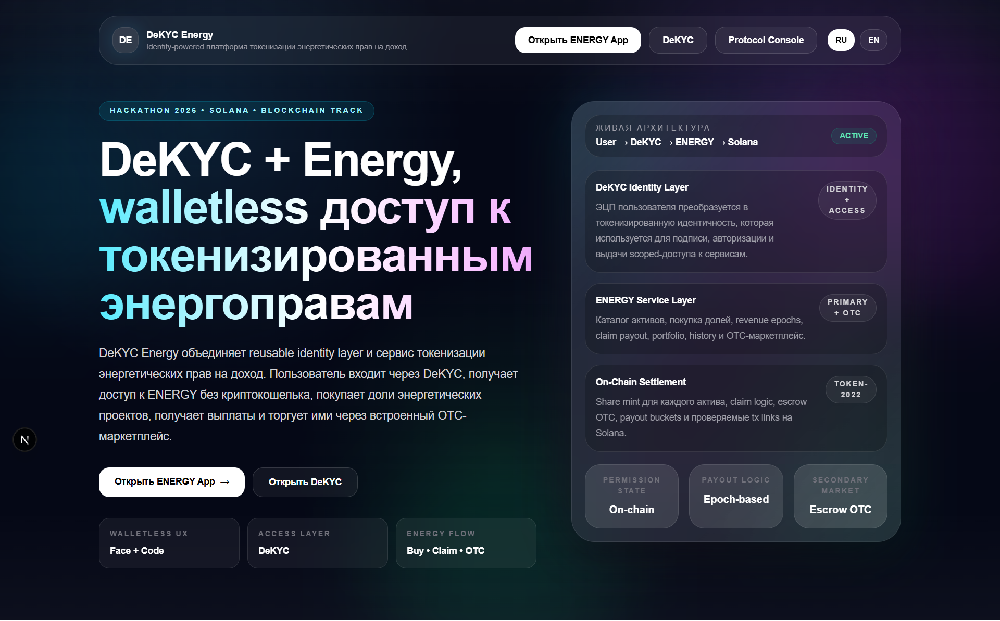
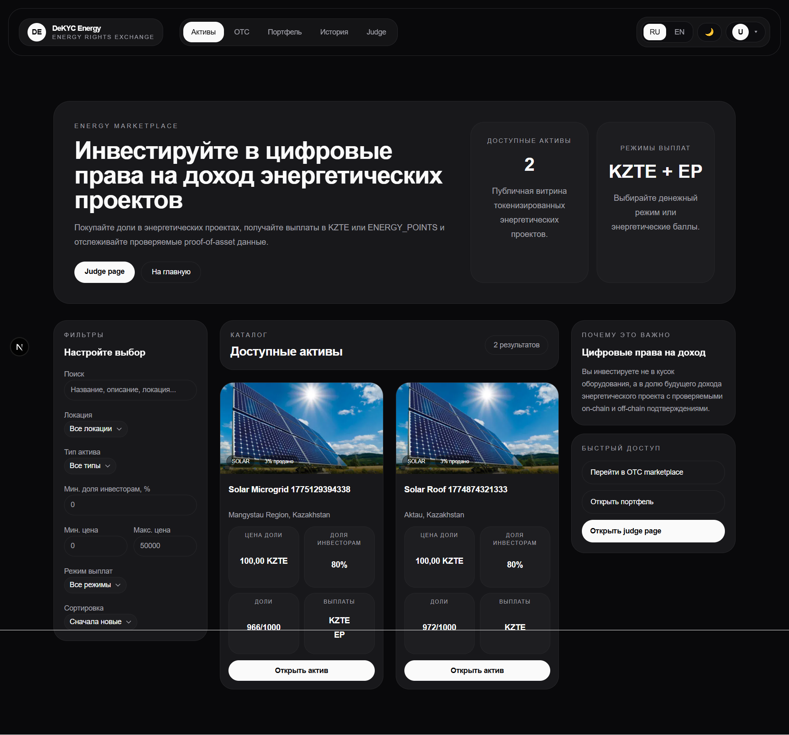
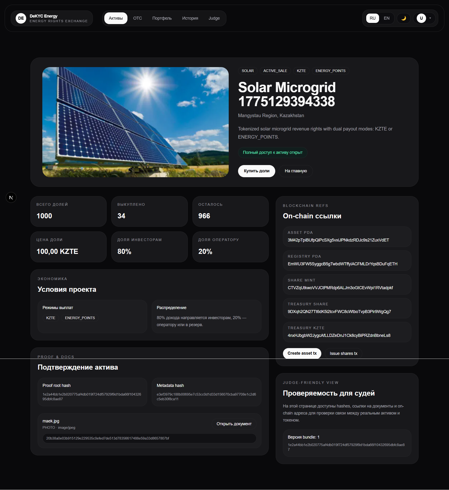
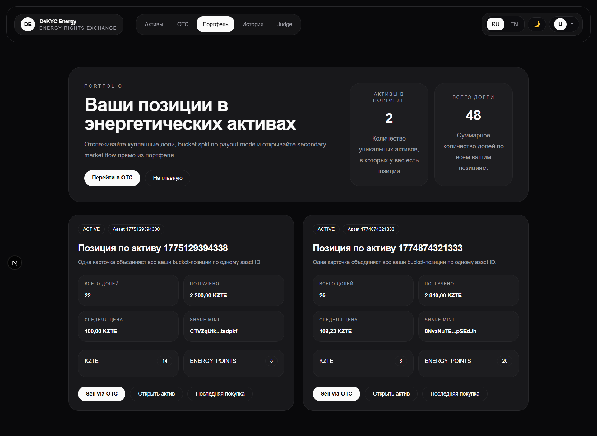
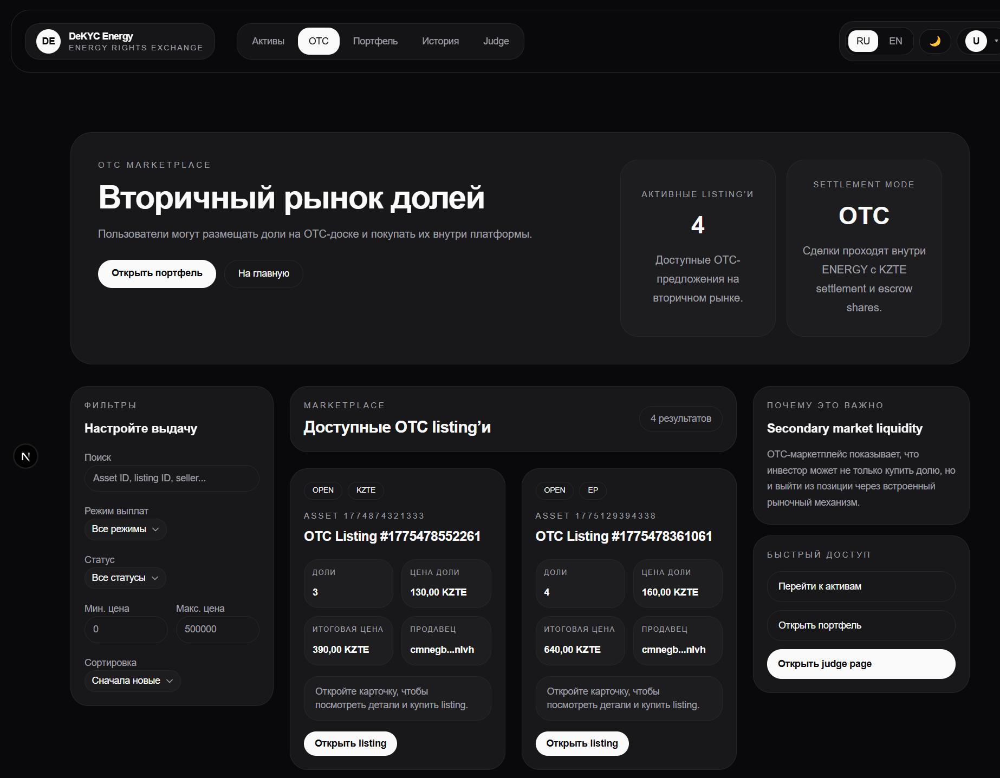
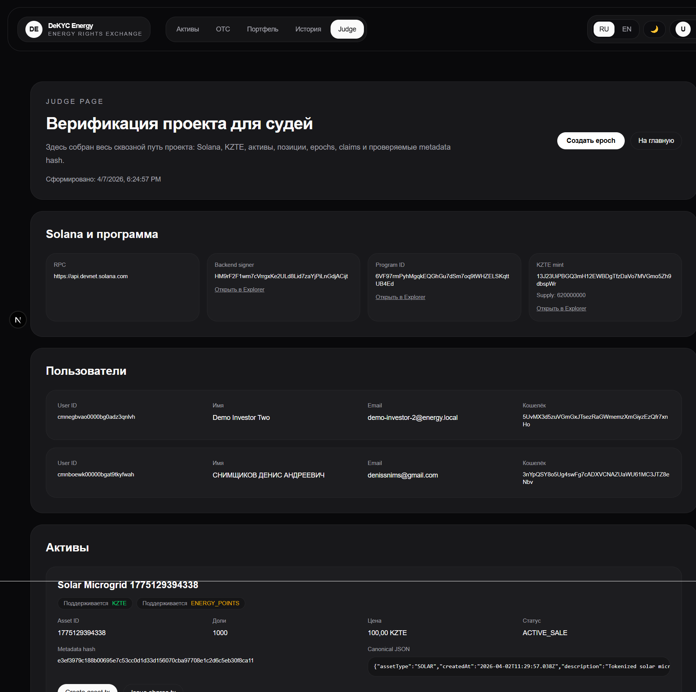

# DeKYC Energy ⚡  
### walletless платформа токенизации энергетических прав на доход на Solana

[](https://github.com/denisthe12/dekyc-protocol/actions/workflows/ci-apps.yml)
[](https://github.com/denisthe12/dekyc-protocol/actions/workflows/ci-solana.yml)
[](https://solana.com)
[](#)
[](#)
[](#)
[](#)
[](#)

> **DeKYC Energy** — это продукт, где пользователь входит через **DeKYC**, получает доступ **без криптокошелька** и инвестирует в **токенизированные права на доход от энергетических проектов**.

[🚀 Демо](#) · [🎥 Видео-демо](#) · [🖥 Live App](#) · [🖼 Скриншоты](#скриншоты) · [📑 Презентация](#) · [📚 Docs](docs/) · [🛡 DeKYC](docs/DeKYC.md) · [⚡ ENERGY](docs/ENERGY.md)

---


---

## Что это за проект?

**DeKYC Energy** объединяет два слоя:

- **DeKYC** — identity и permission layer, который использует **ЭЦП / цифровую подпись** как основу доверенной идентичности и контролируемого доступа.
- **ENERGY** — инвестиционный сервис, где пользователь покупает цифровые доли **в праве на доход**, получает выплаты и может продать позицию через OTC.

### Чем проект отличается от обычной tokenization demo?

Потому что здесь есть не только tokenization, но и:

- **вход через DeKYC**
- **walletless UX**
- **private/public access**
- **proof bundle**
- **epoch-based payouts**
- **OTC secondary market**
- **judge-friendly on-chain verification**

---

## Какую проблему он решает?

### Проблема 1 — инвестировать в энергетику сложно
Для обычного человека это звучит как бюрократический и непонятный процесс.

### Проблема 2 — identity и access ломают UX
Обычные сервисы заставляют пользователя:

- проходить KYC снова и снова,
- передавать личные данные множеству платформ,
- разбираться в wallet’ах и web3-фрикции.

### Решение
**DeKYC Energy** делает инвестиционный сценарий понятным:

**DeKYC login → custodial address → buy → epoch → claim → OTC**

---

## Почему DeKYC здесь — главная фича? 🛡

Большинство проектов по токенизации заканчиваются на связке:

- подключи кошелек,
- купи токен,
- посмотри tx.

**DeKYC Energy** идет дальше:

- пользователь входит через **DeKYC**
- идентичность опирается на **ЭЦП**
- доступ к данным управляется permission-моделью
- сервис получает только нужный scope
- пользователь не обязан пользоваться криптокошельком

> **Коротко:** DeKYC превращает контекст ЭЦП-идентичности в reusable identity layer для сервисов.

---

## Почему именно ENERGY? ⚡

Мы выбрали energy use case, потому что:

- для граждан энергетика сегодня выглядит слишком сложной для инвестирования;
- для небольших операторов и локальных energy-проектов нужен понятный способ привлечения капитала;
- для B2B-потребителей энергии интересен payout не только в деньгах, но и в **ENERGY_POINTS**.

---

## Почему Solana? 🌐

- **Скорость** — подходит для asset creation, buy, claim и OTC flow.
- **Дешевые транзакции** — важны для частых state transitions.
- **Composability** — Anchor, PDA и Token-2022 естественно подходят архитектуре проекта.
- **Token-2022 fit** — отдельные mint’ы для **KZTE**, **share tokens** и **ENERGY_POINTS**.

---

## Что уже работает? ✅

- вход через **DeKYC**
- walletless custodial flow
- **KZTE** demo settlement
- несколько on-chain energy assets
- primary buy
- revenue epochs
- claim payout
- OTC listing + fill
- portfolio
- history с tx links
- judge page
- proof bundle / docs flow
- i18n + dark/light theme
- GitHub CI

---

## Как это устроено? 🧩

```text
DeKYC Platform
      ↓
DeKYC Backend
      ↓
ENERGY Frontend
      ↓
ENERGY Backend
      ↓
Solana + Anchor + Token-2022
```

### Основные части репозитория

- `apps/platform` — фронтенд DeKYC
- `apps/api` — бэкенд DeKYC
- `apps/energy-web` — фронтенд ENERGY
- `apps/energy-api` — бэкенд ENERGY
- `programs/permission_protocol` — Solana-программы:
  - `permission_protocol`
  - `tokenization_case`

Подробнее: [docs/architecture.md](docs/architecture.md)

---

## Скриншоты

### 1. Landing




### 2. Marketplace




### 3. Asset Detail




### 4. Portfolio




### 5. OTC




### 6. Judge Page




### 7. Demo GIF


---

## Quick Start 🚀

### Требования
- Node.js 20+
- pnpm 10+
- Rust stable
- Solana CLI
- Anchor 0.32.1
- PostgreSQL

### Установка

```Bash
git clone https://github.com/denisthe12/dekyc-protocol.git
cd dekyc-protocol
pnpm install
```

### Environment variables

В проекте используются файлы:

- `apps/api/.env`
- `apps/energy-api/.env`
- `apps/platform/.env.local`
- `apps/energy-web/.env.local`

> Для них нужно использовать `.env.example` (находится в каждой папке) и при необходимости вручную поправить значения.

### Prisma

```Bash
pnpm --filter api prisma:generate
pnpm --filter energy-api prisma:generate
```

### Solana build

```Bash
cd programs/permission_protocol
anchor build
cd ../../
```

### Запуск

```Bash
pnpm dev:platform
pnpm dev:api
pnpm dev:energy-web
pnpm dev:energy-api
```

### Локальные адреса

- **DeKYC frontend** — `http://localhost:3000`
- **DeKYC API** — `http://localhost:3001`
- **ENERGY frontend** — `http://localhost:3200`
- **ENERGY API** — `http://localhost:3201`

---

## Документация 📚

- [docs/DeKYC.md](docs/DeKYC.md)
- [docs/ENERGY.md](docs/ENERGY.md)
- [docs/architecture.md](docs/architecture.md)
- [docs/product.md](docs/product.md)
- [docs/api.md](docs/api.md)
- [docs/roadmap.md](docs/roadmap.md)

---

## Почему это интересно? 💡

### Для судей
- есть полный working flow;
- есть **Why Solana**;
- есть CI, docs и judge page;
- проект выглядит как продукт, а не как набор файлов.

### Для рынка
- DeKYC можно переиспользовать как identity infrastructure;
- ENERGY можно развивать как vertical product для tokenized energy revenue rights.

---

## Roadmap 🛣

- [x] DeKYC login
- [x] walletless custodial flow
- [x] energy assets
- [x] primary buy
- [x] payout epochs
- [x] claim
- [x] OTC
- [x] judge page
- [ ] production-grade biometric verification
- [ ] richer proof bundle
- [ ] advanced payout automation
- [ ] pilot в real-world energy scenario

Полный roadmap: [docs/roadmap.md](docs/roadmap.md)

---